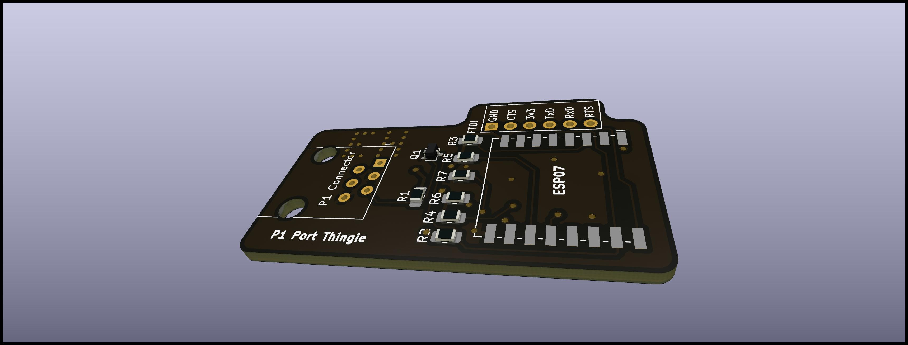
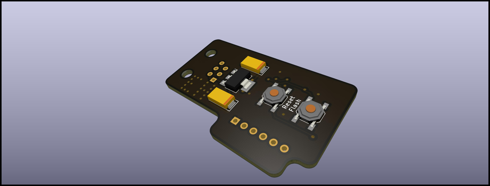
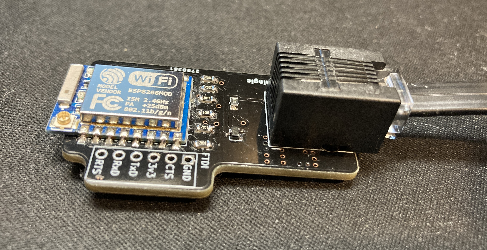

# P1 Port Thingie
This is a small board to bridge the P1 port of the Swedish electricity meters with Home Assistant.
The level conversion part of the schematics is based on the examples on the [software](https://github.com/psvanstrom/esphome-p1reader) github page.
The rest is basically a 5v to 3.3V LDO and ESP07 required components.

It can be programmed with esphome using a ftdi cable or similar.
Installation guide and software: [https://github.com/psvanstrom/esphome-p1reader](https://github.com/psvanstrom/esphome-p1reader).

